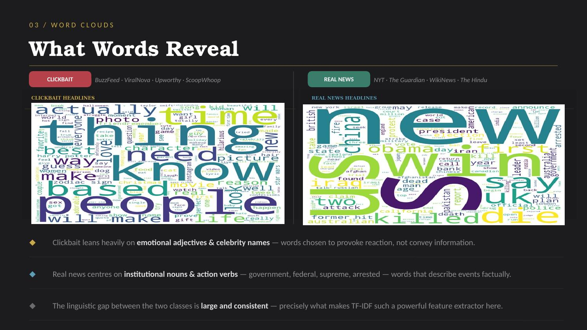

# Clickbait Detection — Binary NLP Classification

> Benchmarking 5 classical ML algorithms on 32,000 news headlines to detect clickbait using TF-IDF feature extraction. Best model (SGD Classifier) achieves **94.25% accuracy** — within 4–5% of transformer-based approaches (BERT/RoBERTa) with zero GPU requirement and sub-second inference.


---

## Business Problem

Clickbait headlines are engineered to exploit curiosity rather than inform readers — costing publishers credibility and costing platforms user trust. This project builds an automated, lightweight classifier that flags clickbait headlines at scale, across any platform, without requiring GPU infrastructure.

**Question:** Can classical machine learning, using nothing but word-frequency statistics, reliably distinguish clickbait from real news? Or is this a problem that requires deep learning to solve well?

---

## Dataset

[Clickbait Dataset (Aman Anand) — Kaggle](https://www.kaggle.com/datasets/amananandrai/clickbait-dataset)

| | |
|---|---|
| **Total headlines** | 32,000 |
| **Clickbait (label=1)** | 16,000 |
| **Real news (label=0)** | 16,000 |
| **Missing values** | 0 |
| **Clickbait sources** | BuzzFeed, Upworthy, ViralNova, ThatsCoop, ScoopWhoop, ViralStories |
| **Real news sources** | WikiNews, New York Times, The Guardian, The Hindu |

The dataset is perfectly balanced — no oversampling or class-weighting was required, and reported accuracy is not inflated by class skew.

---

## Exploratory Data Analysis

### What the Words Reveal

Word frequency analysis on raw (uncleaned) headlines exposed a stark linguistic divide between the two classes:

| Clickbait | Real News |
|---|---|
| thing, know, best, actually, favorite, based, zodiac, celebrity | president, government, election, attack, military, kill, arrested |
| Emotional adjectives, vague nouns, curiosity hooks | Institutional nouns, factual action verbs, named entities |

This isn't just a stylistic observation — it has a name in psycholinguistics. Clickbait exploits the **information gap** (Loewenstein, 1994): the discomfort of an incomplete thought that drives a reader to click and resolve it. Real news, by contrast, front-loads the *who* and *what*, optimizing for information transfer rather than curiosity. TF-IDF, the feature extraction method used downstream, is effectively a statistical formalization of this same gap — it mathematically rewards words that are common within a class but rare across the dataset as a whole.



---

## NLP Pipeline

| Step | Technique | Purpose |
|---|---|---|
| 1 | Lowercasing + special character removal | Normalize raw text |
| 2 | Stopword removal (NLTK + custom list) | Strip zero-signal words (*the, a, is, ur, im*) |
| 3 | CountVectorizer | Convert text → sparse bag-of-words matrix (25,600 × vocab) |
| 4 | TF-IDF Transformer | Downweight common terms, upweight class-distinctive terms |
| 5 | Train/test split | 80/20, `random_state=42`, stratification not required (balanced classes) |

Stopword removal and TF-IDF serve complementary roles: stopwords are a **hard filter** (in/out), while TF-IDF is a **soft filter** that scales word importance by class-distinctiveness — even among words that survive the stopword pass.

---

## Models Benchmarked

Five classical algorithms were trained and evaluated on identical TF-IDF features:

| Model | Accuracy | Configuration | Verdict |
|---|---|---|---|
| **SGD Classifier** | **94.25%** | `loss='log', penalty='L2', alpha=1e-4` | **Winner** |
| Random Forest | 87.9% | `n_estimators=70, min_samples_leaf=30` | Decent |
| Decision Tree | 85.2% | `max_depth=10, min_samples_leaf=15` | Limited |
| Logistic Regression | 83.2% | `C=1e-8` (intentionally over-regularized) | Underfit |
| K-Nearest Neighbors | 79.6% | `n_neighbors=15` | Fails on sparse data |

**Why SGD won:** Online learning combined with L2 regularization is purpose-built for high-dimensional sparse matrices like TF-IDF output. KNN, by contrast, suffers from the curse of dimensionality — with 25,000+ features, distance metrics become close to meaningless.

---

## Results — SGD Classifier

| Metric | Score |
|---|---|
| Accuracy | 94.25% |
| Precision | 94.23% |
| Recall | 94.23% |
| F1 Score | 94.23% |
| ROC AUC | 94% |

**Confusion Matrix** (n = 6,400 test headlines)

| | Predicted: Not Clickbait | Predicted: Clickbait |
|---|---|---|
| **Actual: Not Clickbait** | 3,013 (TN) | 187 (FP) |
| **Actual: Clickbait** | 183 (FN) | 3,017 (TP) |

False positives ≈ false negatives — confirming no class bias, exactly what a balanced dataset should produce.

### Sample Predictions

| Headline | Actual | Predicted | Result |
|---|---|---|---|
| "The New Star Wars Trailer Is Here To Give You Chills" | Clickbait | Clickbait | ✅ |
| "Hurry grab our promo now!" | Clickbait | Clickbait | ✅ |
| "Scientology defector arrested after attempting to leave" | Real News | Real News | ✅ |
| "Scientists Discover New Species In Amazon" | Real News | **Clickbait** | ❌ |

The one notable miss is instructive: a real headline with *sensational framing but no emotional vocabulary* slipped past a model that, by design, only sees word frequency — not semantic context. This is precisely the gap that contextual language models like BERT are built to close.

---

## How This Compares to Deep Learning

| Approach | Accuracy | Requires GPU? | Train Time |
|---|---|---|---|
| BERT / RoBERTa (fine-tuned) | 98–99% | Yes | Minutes–hours |
| LSTM + GloVe | 95–97% | Recommended | Minutes |
| **SGD + TF-IDF (this project)** | **94.25%** | **No** | **Seconds** |

A classical, fully interpretable pipeline lands within 4–5 points of state-of-the-art transformer models — at a fraction of the compute cost and with zero infrastructure overhead. For most production use cases where latency and cost matter more than the last few points of accuracy, this is a legitimate trade-off, not just a budget compromise.

---

## Key Takeaways

1. **SGD Classifier reached 94.25%** — within 4–5% of BERT, with zero GPU requirement.
2. **A perfectly balanced dataset** eliminated the need for oversampling — a clean advantage rarely available in real-world data.
3. **KNN provably fails on sparse NLP data** — a textbook case of algorithm-data mismatch, not poor tuning.
4. **Hyperparameter choices materially change outcomes** — e.g. `C=1e-8` for Logistic Regression is a deliberate floor test, not a tuning artifact.
5. **Next step:** fine-tune a transformer (BERT/RoBERTa) on the same dataset to directly quantify the accuracy/cost trade-off identified above.

---

## Tech Stack

`Python` · `pandas` · `scikit-learn` · `NLTK` · `WordCloud` · `matplotlib` · `seaborn`

## Repository Structure

```
clickbait-detection/
├── data/                  # Raw dataset (Kaggle CSV)
├── notebooks/              # Full analysis notebook
├── images/                 # Word clouds, confusion matrix, ROC curve
├── requirements.txt
└── README.md
```

## Run It Locally

```bash
git clone https://github.com/mc1025/clickbait-detection.git
cd clickbait-detection
pip install -r requirements.txt
jupyter notebook notebooks/clickbait-classification.ipynb
```

---

## Data Source

[Clickbait Dataset](https://www.kaggle.com/datasets/amananandrai/clickbait-dataset) by Aman Anand, via Kaggle.

## Author

**Michael Chen** — MSBA Candidate, University of Louisville
[GitHub](https://github.com/mc1025)
